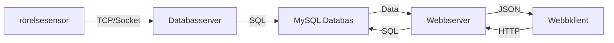
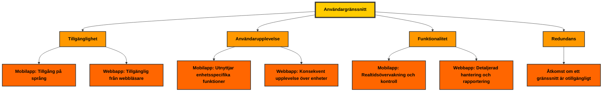
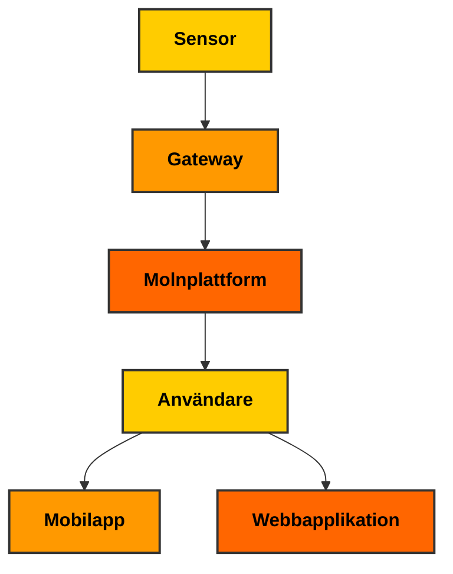

# Mål med projektet
Målet med projektet syftar till att bygga ett övergripande säkerhetssystem för att förhindra brott, olyckor
och att förenkla interaktione med elektroniska enheter i hemmet..
**Värderingar:**
- Smart hem
- Ökad säkerhet
- Trygghet
- Minskad stress om man är borta hemifrån
- Automatisering
## kraven för produkten

**Funktionella krav**
- Röstigenkänning
- Brandlarm
- Elförbrukning
- Elsäkerhet.
- Voice Assistant
- Larm
- Kameraövervakning
- Styrning av smarta hem produkter.

# steg 1. Motion sensor
Så fort motion sensorn triggas så skickas notis.
Counter på lcdn skicka den datan exempelvis varje timme. Hur många gånger den har triggats.
Lampa som tänds när vi triggar den.
Säkerhet? kunna aktivera den för att direkt skicka signal om en dörr öppnas.

# Pipeline
1. Översiktsdiagram (High-Level Architecture Diagram)
- Syfte: Ge en övergripande bild av hela loT-systemet.
- Innehäll:
- Enheter (sensorer, aktuatorer, gateways).
    * pico w( microchip som driver sensort och hämtar in datan)
    * Ultrasonic sensor(mäter om avståndet förändras ger signal)
    * rasberry pico 5(server & databas för att hantera och lagra datan)
    * routern( i detta fall gatewayen för att skicka till datan till servern och databasen)
    * lcd skärm på picon som visar information när den triggas.
- Kommunikationskanaler (Wi-Fi, Zigbee, Bluetooth).
    - wi-Fi
    - Bluetooth
    - Mobilnätverk(4G/5G)
    - LAN
    - WAN
    - Molntjänster och databaser. 
  
- Användargränssnitt (mobilappar, webbapplikationer)

- Sensor → Gateway → Molnplattform → Användare
  

2. Nätverksdiagram
- Syfte: Visualisera kommunikationsflöden och nätverkstopologi.
- Innehäll:
- Trädbundna och trädlösa nätverk (LAN, WAN, Wi-Fi, 4G/5G).

	- Vi skickar huvudsakligen data från Picon via hemnätverket (LAN) då vi vill ha en snabb och stabil lösning. Vi behöver dock ha en backup ifall nätverket skulle ligga nere eller ifall det blir strömavbrott. 
	- Därför har vi en lösning där systemet växlar till 4G ifall det skulle ske. På så sätt så säkerställer vi att kritisk data skickas även om nätverket skulle ligga nere. 

- Protokoll som MQTT, COAP, HTTP, eller WebSocket.
	
	- Vi behöver en snabb och effektiv kommunikationslösning  eftersom vi jobbar med ett säkerhetssystem. Vi vill minimera risken för "packetloss" och använder oss av TCP-protokollet. Vi använder MQTT-protokollet ovanpå det eftersom
	- vi jobbar med microdatorer och kräver en lättvikts- och resurseffektiv lösning. MQTT erbjuder QoS-nivåer som gör det lätt att prioritera data som skickas från Picon. 

- Routrar, gateways och nätverksnoder.
- Exempel:
- Enheternas anslutning till nätverket och kommunikationen med molntjänster.

3. Datadiagram
- Syfte: Visa hur data samlas in, bearbetas, lagras och analyseras.
- Innehäll:
- Datakällor (sensorer).
- Dataflöde till bearbetning (real-time eller batch).
- Lagring (databaser, molnbaserade lösningar).
- Dataanalys och visualisering.
- Exempel:
- Sensor → Data Processor → Data Warehouse → Analytics Dashboard.

4. Flödesdiagram (Workflow Diagram)
- Syfte: Beskriva logiken och arbetsflöden i loT-systemet.
- Innehäll:
- Händelsekedjor, t.ex. "om temperatur > X, aktivera fläkt".
- Processer som styrs av loT-enheter.
- Exempel:
- Temperaturavkänning Aktuatoraktivering → Data-loggning.

5. Säkerhetsdiagram
- Syfte: Visualisera säkerhetsätgärder och särbarheter i systemet.
- Innehäll:
- Kryptering av data (TLS/SSL, AES).
- Autentiserings- och auktoriseringsprocesser.
- Nätverkssäkerhet (firewalls, VPN, loT-specifika säkerhetslager).
- Exempel:
-  Sensor → Krypterad Gateway → Krypterad Molntjänst.

6. Deployment Diagram
- Syfte: Beskriva var systemets olika komponenter finns placerade.
- Innehäll:
- Fysiska och virtuella noder (sensornätverk, molnservrar, databaser).
- Kartläggning av nätverkets topologi.
- Exempel:
- Lokala sensorer → Gateway pà plats → Molnserver.

7. Skalbarhetsdiagram
- Syfte: Planera och visa hur systemet kan växa över tid.
- Innehäll:
- Beskrivning av hur fler enheter, användare eller datamängder hanteras.
- Mekanismer för att hantera högre belastning.
- Exempel:
- Lägga till fler sensorer eller gateways utan att päverka prestanda.
