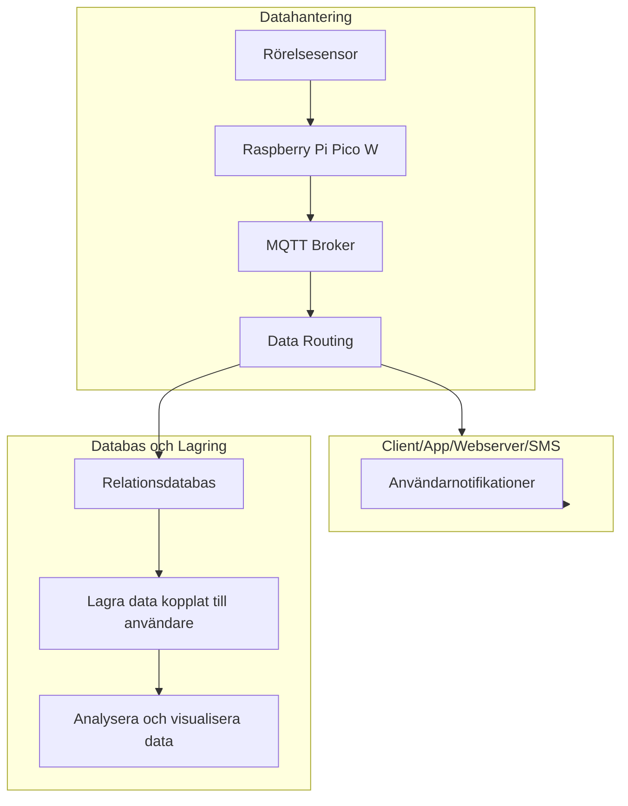

# Datahantering
## insamling hårdvara
- Datan kommer att samlas in via en rörelsesensor kopplad till rasberry pico w.
- Vi sparar enbart data och skickar iväg den när den faktiskt triggas.
- När sensorn triggas så skickar den enbart data med enhetsid, klockslag, datum och avstånd till en mqtt-broker server.
- för att minska trafiken till servern och för att det ska gå snabbare att vidarbehandla datan så kommer vi formatera datan till en json på picon.

## Skicka datan från hårdvara till en mqtt-broker
- Moln lösning eller Rasberry pi? Cloud MQTT services (e.g., HiveMQ, EMQX, Adafruit IO, AWS IoT).
- mqtt-brokern prenumererar på data från varje enhetsid.
- när en förfrågan har besvarats så dirigeras meddelande direkt med information till client/app/webbsever/sms. dirigerar datan så den lagras i en relationsdatabas.

## Databas.
## data lake
## data lakehouse?
behöver vi komma åt våran grund data ?
- lagra datan kopplat till varje användare
### SQLITE
Lätt att använda och komma igång med.
### time series database 
bra när du ska ha timestamped data
key value bra att spara data för specifika enheter
### Document oriented.
lagrar data i json liknande format 
kan lägga till fler servrar för att utöka prestandan.
flexibel hantering

### Key-Value Store 
enkelt att komma åt datan och hantera den?

## vad ska vi använda datan till?
- se timestamps på när ett potentiellt inbrott har ägt rum för att underlätta polisens arbete med att följa potentiell inbrottstjyv.
- Notifiera användaren om att något har hänt.

