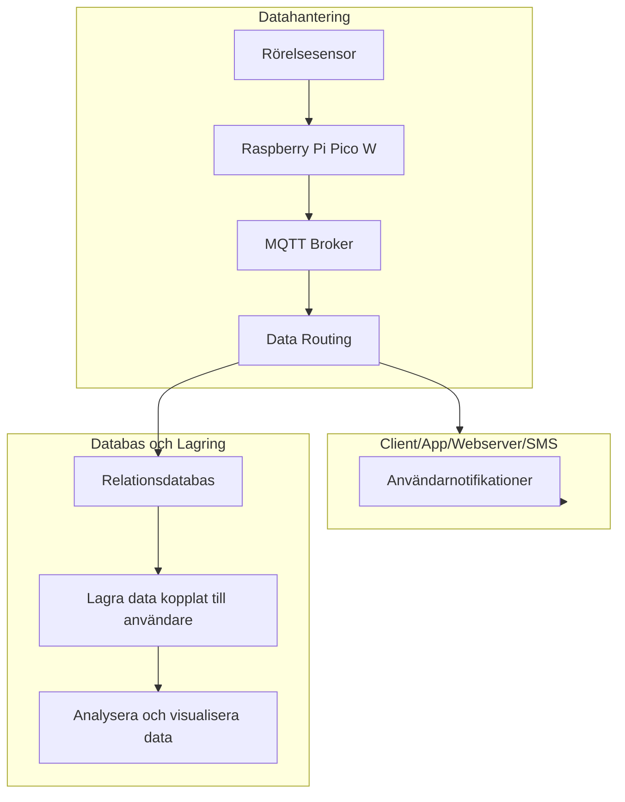

# Datahantering
## insamling hårdvara
- Datan kommer att samlas in via en rörelsesensor kopplad till rasberry pico w.
- Vi sparar enbart data och skickar iväg den när den faktiskt triggas.
- När sensorn triggas så skickar den enbart data med enhetsid, klockslag, datum och avstånd till en mqtt-broker server.
- för att minska trafiken till servern och för att det ska gå snabbare att vidarbehandla datan så kommer vi formatera datan till en json på picon.

## Skicka datan från hårdvara till en mqtt-broker.
- mqtt-brokern prenumererar på data från varje enhetsid.
- när en förfrågan har besvarats så dirigeras meddelande direkt med information till client/app/webbsever/sms. dirigerar datan så den lagras i en relationsdatabas.

## Databas som lagrar datan time series databas?
- lagra datan kopplat till varje användare
- 

