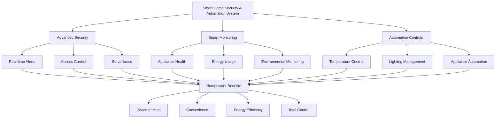

# About the system
Smart Home Security & Automation System enhances safety, convenience, and energy efficiency by integrating advanced security measures, smart monitoring, and automation controls. The system ensures real-time insights into home security and appliance health, providing homeowners with peace of mind and total control over their living environment.


# IoT & soft RTS, Edge & Cloud security solution stack.
## Edge devices.
###  Raspberry Pi Pico WH (RTS)
Edge device which will collect data from the ultrasonic sensor, aggregate the pulses sent and received to measure distance to an object. If that distance is changing rapidly the alarm will go off and the data will be serialised and sent to the MQTT-Broker which will handle the notification to the user and send the data aggregated to the cloud database.
###  Ultrasonic sensor HC-SR04 
Device to send out signals that measures the distance to an object. If the distance to that object is changing rapidly, an alarm will go out and data will be sent. 
## Fog raspberry zero 2 w
MQTT BROKER
## Cloud
InfluxDB 
Web Application
twilio api.
## Communication
### Wi-Fi
Main communication. Cheaper and more stable in the long run. We will expand our project in the future with cameras that use more bandwidth.
### Mobile network (4G)
Backup communication if Wi-Fi is down. Notification will be sent if the backup communication system is online. 

## Protocols

### MQTT
We want to wait for a response regardless of response time and we want to use the certainty of data transmission by MQTT using TCP as a lower layer protocol.
### HTTP
To transmit the data from the MQTT-BROKER to our Database and our GUI Application we will use HTTP as higher level protocol with TCP as lower level protocol

## Database
### InfluxDB (TSDB):
Will aggregate the data one step further and also send out initial data to the Web/Mobile application. Using built in functions we can request values like “sum” over a specified time period. 
## Programming Language & Tools
### Python
To build our GUI and MQTT-BROKER
### C/C++
For our real time requirements - Sensor triggered -> Notification sent.
### Query language 
Built-in database InfluxQL and Flux.
###

## IoT eller RTS?
EDGE device will act as a RTS the MQTT-BROKER will be the divider which seprates to one RTS Channel and one IoT channel 

## Serialisering / Dataomvandling
### Pico W
Data will be serialised at the pico with unit ID, timestamp(date,time) when it's triggered, and with what impact the sensor was mänipulated.  
## Aggregering

Edge & Cloud
Pico W &  Databasen InfluxDB

## API
Kommunicerar mellan apparna och databaserna
### twilio
Cloud API solution to send out sms notifications triggered by the ultrasonic sensor
### MQTT-BROKER
We will have a MQTT-BROKER to only gather the data when the device has collected something by its criteria, and we want to send out a request and wait for the response regardless of how long the response time will be.
	
### RESTful
GET – Retrieve a resource
POST – Create a new resource
PUT – Update a resource (or create it if it does not exist)
PATCH – Partially update a resource
DELETE – Remove a resource
4o


## GUI 
Mobilapp/Webbsida
Communication with Database
Cloud based

## Notifications
An SMS will be sent when the motion sensor is triggered. We will be using the cloud-based communication API Twilio, which requires an internet connection to send notifications via SMS. Twilio will be integrated into our MQTT broker, allowing it to send an SMS notification immediately when motion is detected. The motion sensor will publish a message to an MQTT topic, and Twilio will act as a subscriber, processing the message and triggering the SMS alert.
## Mobile app
Our mobile app will function as a hub for managing settings and viewing the history of previous alerts. Users will be able to configure notification preferences, review past motion events etc.


mermaid
graph TD
    subgraph Edge["Edge Layer (IoT with Soft RTS)"]
        subgraph "Motion sensor"
            A[Ultrasonic Sensor from Kit]
        end
        
        subgraph Processing["Edge Processing Pico W"]
            C["Local Processing:<br/>- Data Serialization<br/>- Device ID Addition<br/>- Initial Aggregation"]
        end
    end

    subgraph Cloud["Cloud Infrastructure"]
        E["MQTT Broker:<br/>- Docker on Fly.io<br/>- Advanced Processing<br/>- Soft RTS Management"]
        F["InfluxDB (TSDB):<br/>- Line Protocol<br/>- Cloud Aggregation<br/>- Time Series Data"]
        G["RESTful API:<br/>- Data Access Layer<br/>- Service Integration"]
        I["Twilio API:<br/>- SMS Gateway<br/>- Alert Management"]
    end

    subgraph Interface["User Interface Layer"]
        H["GUI:<br/>- Mobile App<br/>- Web Interface<br/>- Real-time Updates"]
        J["End User"]
    end

    A -->|"Sensor Data"| C
    C -->|"Processed Data<br/>+ Device ID<br/>Wi-Fi / 4G<br/>ARP, DNS, TCP, MQTT"| E
    E -->|"Line Protocol<br/>Time Series Data"| F
    F -->|"Aggregated Data"| G
    G -->|"Cloud Communication<br/>Secure WebSocket"| H

    E -->|"Notification Trigger"| I
    I -->|"SMS Alert"| J

    classDef edge fill:#f9f33333,stroke:#333,stroke-width:2px
    classDef cloud fill:#9f988888,stroke:#3336,stroke-width:2px
    classDef api fill:#f994,stroke:#3337,stroke-width:2px
    classDef ui fill:#fb34,stroke:#3338,stroke-width:2px
    classDef sms fill:#6cf5,stroke:#3339,stroke-width:2px
    class A,C edge
    class E,F cloud
    class G,I api
    class H ui
    class J sms

kan du ändra så mqttbrokern hamnar i en egen box med raspberry zero 2 som fog device

ChatGPT sade:
Här är den uppdaterade versionen av ditt flödesdiagram med en "Fog Layer" där en Raspberry Pi Zero 2 fungerar som en fog-enhet och hanterar MQTT-brokern.

Iot Edge Fog Cloud
Jag har lagt till en "Fog Layer" där en Raspberry Pi Zero 2 hanterar MQTT-brokern och fungerar som en mellanliggande bearbetningsnod mellan Edge-enheten (Pico W) och molnet. Säg till om du vill justera något ytterligare! 🚀

```mermaid
graph TD
    subgraph Edge["Edge Layer (IoT with Soft RTS)"]
        subgraph "Motion sensor"
            A[Ultrasonic Sensor from Kit]
        end
        
        subgraph Processing["Edge Processing Pico W"]
            C["Local Processing:<br/>- Data Serialization<br/>- Device ID Addition<br/>- Initial Aggregation"]
        end
    end

    subgraph Fog["Fog Layer"]
        D["Raspberry Pi Zero 2:<br/>- MQTT Broker<br/>- Pre-processing<br/>- Local Storage"]
    end
    
    subgraph Cloud["Cloud Infrastructure"]
        E["Advanced Processing:<br/>- Soft RTS Management"]
        F["InfluxDB (TSDB):<br/>- Line Protocol<br/>- Cloud Aggregation<br/>- Time Series Data"]
        G["RESTful API:<br/>- Data Access Layer<br/>- Service Integration"]
        I["Twilio API:<br/>- SMS Gateway<br/>- Alert Management"]
    end

    subgraph Interface["User Interface Layer"]
        H["GUI:<br/>- Mobile App<br/>- Web Interface<br/>- Real-time Updates"]
        J["End User"]
    end

    A -->|"Sensor Data"| C
    C -->|"Processed Data<br/>+ Device ID<br/>Wi-Fi / 4G<br/>ARP, DNS, TCP, MQTT"| D
    D -->|"MQTT Communication"| E
    E -->|"Line Protocol<br/>Time Series Data"| F
    F -->|"Aggregated Data"| G
    G -->|"Cloud Communication<br/>Secure WebSocket"| H

    E -->|"Notification Trigger"| I
    I -->|"SMS Alert"| J

    classDef edge fill:#f9f33333,stroke:#333,stroke-width:2px
    classDef fog fill:#aa99ff88,stroke:#333,stroke-width:2px
    classDef cloud fill:#9f988888,stroke:#3336,stroke-width:2px
    classDef api fill:#f994,stroke:#3337,stroke-width:2px
    classDef ui fill:#fb34,stroke:#3338,stroke-width:2px
    classDef sms fill:#6cf5,stroke:#3339,stroke-width:2px
    class A,C edge
    class D fog
    class E,F cloud
    class G,I api
    class H ui
    class J sms
